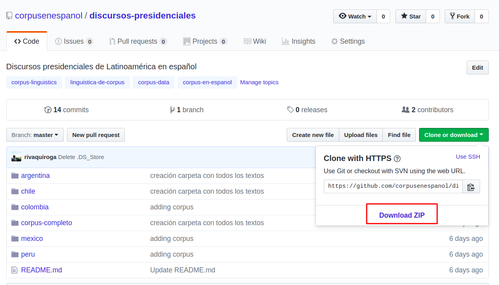
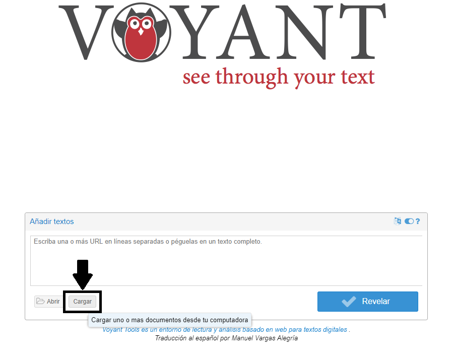
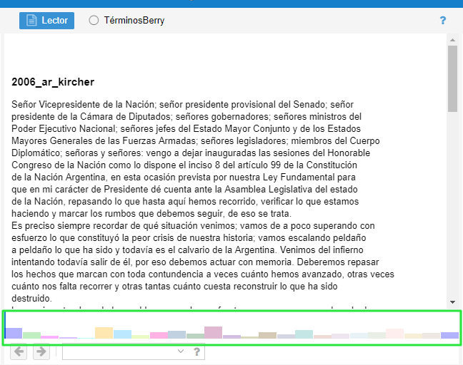
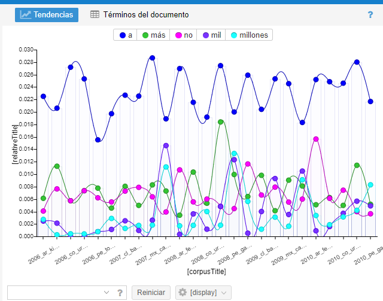
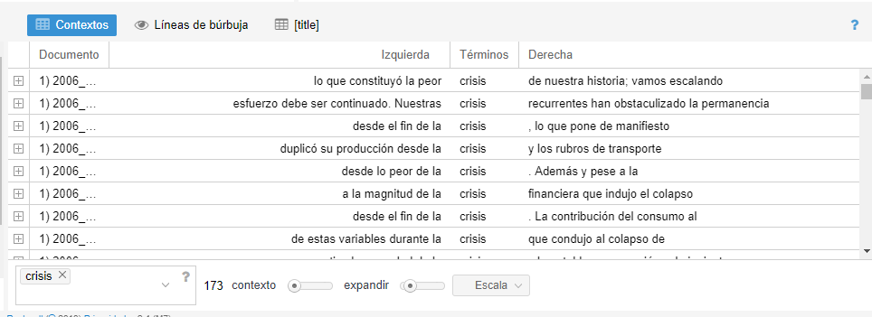
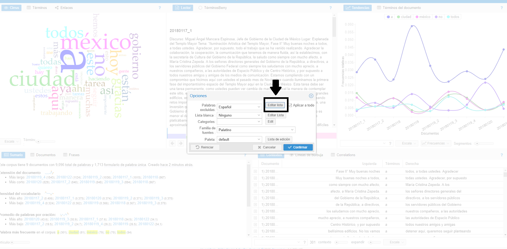
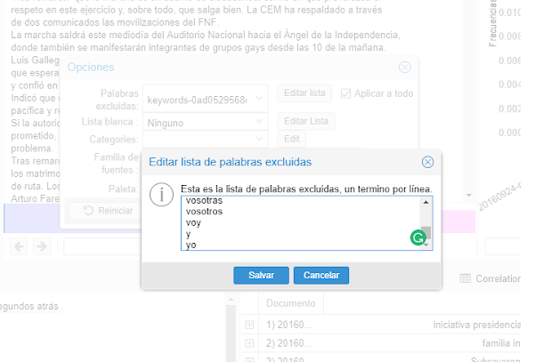
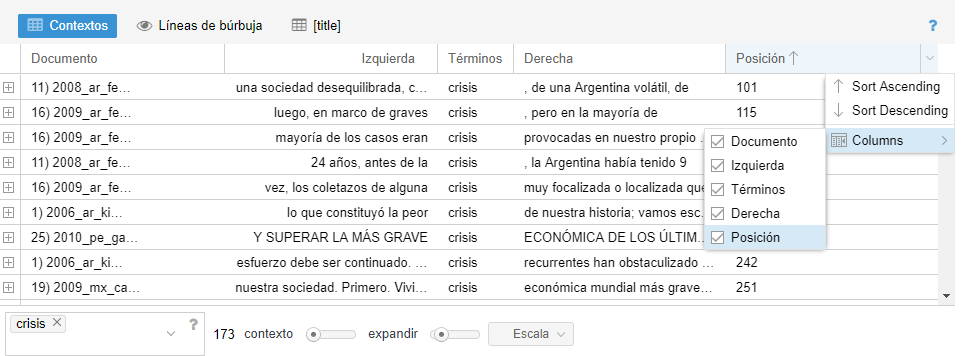
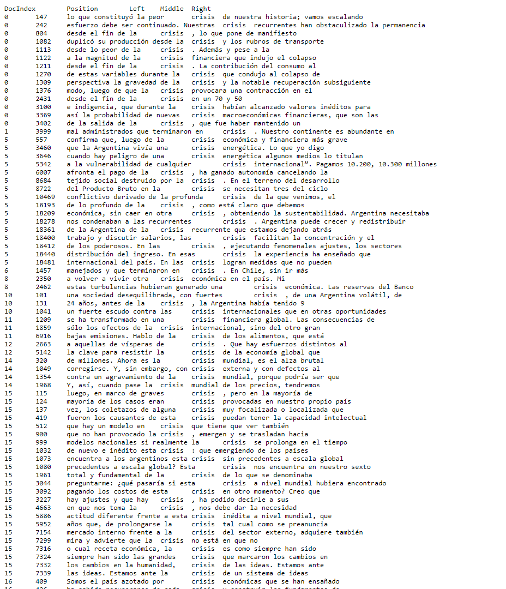

# Análisis de corpus con Voyant Tools

El análisis de corpus es un tipo de [análisis de contenido](http://vocabularios.caicyt.gov.ar/portal/index.php?task=fetchTerm&arg=26&v=42), que permite hacer comparaciones a gran escala entre los textos contenidos en dichos corpus.

Desde el inicio de la computación, lingüistas y especialistas de la [recuperación de la información](http://vocabularios.caicyt.gov.ar/portal/?task=fetchTerm&arg=178&v=42) han creado y utilizado software para apreciar patrones que no son evidentes en la lectura o bien, para corroborar hipótesis que intuían al leer ciertos textos. Por ejemplo: los patrones de uso y decaimiento de ciertos términos en una época dada, los contextos izquierdos y derechos de ciertas palabras, o las expresiones que distinguen a un grupo de textos frente a otros.

Voyant Tools (Sinclair y Rockwell, 2016) es una herramienta basada en Web y no requiere de la instalación de ningún tipo de software especializado pues funciona en cualquier equipo con conexión a internet. 

Como se ha dicho en este otro [tutorial](https://programminghistorian.org/es/lecciones/analisis-de-corpus-con-antconc), 

Al finalizar este tutorial, tendrás la capacidad de:

* Armar un corpus en texto plano
* Pensar y aplicar diferentes técnicas de segmentación de corpus
* Identificar características básicas del corpus:
	* Extensión de los documentos subidos
	* Densidad léxica (llamada densidad de vocabulario en la plataforma)
	* Promedio de palabras por oración
	* Relevancia (llamadas "palabras distintivas")
* Realizar consultas específicas sobre el corpus:
	*  Buscar palabras clave en contexto
	* Identificar patrones de uso de un término
	* Leer diferentes estadísticas sobre los vocablos (frecuencia absoluta y relativa, tendencia, curtosis, asimetría estadística)
* Exportar los datos y las visualizaciones en diferentes formatos (csv, png, html)

## Creando un corpus en texto plano

Si bien VoyantTools puede trabajar con muchos tipos de formato (HTML, XML, PDF, RTF, y MS Word); en este tutorial utilizaramos texto plano. El texto plano tienen tres ventajas fundamentales: no tiene ningún tipo de formato adicional, no requiere un programa especial y tampoco  o conocimiento extra.

### 1. Buscar textos
Lo primero que debes hacer es buscar la información que te interesa. Para este tutorial, [Riva Quiroga](https://twitter.com/rivaquiroga) y yo preparamos un corpus de los discursos anuales de presidentes de Argentina, Chile, Colombia, México y Perú (¡gracias [Pamela Sertzen](https://twitter.com/madvivacious)!) entre 2006 y 2010, es decir dos años antes y después de la crisis económica de 2008. 

### 2. Copiar en editor de texto plano
Una vez localizada la información, el segundo paso es copiar el texto que te interesa desde la primera palabra dicha hasta la última y guardarla en un editor de texto sin formato. Por ejemplo:
* en Windows podría guardarse en [Bloc de Notas](https://web.archive.org/web/20091013225307/http://windows.microsoft.com/en-us/windows-vista/Notepad-frequently-asked-questions)
* en Mac, en [TextEdit](https://support.apple.com/es-mx/guide/textedit/welcome/mac); 
* y en Linux, en [Gedit](https://wiki.gnome.org/Apps/Gedit).

### 3. Guardar archivo

Cuando guardes el texto debes considerar tres cosas esenciales:

La primera es que, si los textos de tu corpus están en español, deberás **guardarlos en UTF-8**, que es un formato de codificación de caracteres estándar para este idioma. 

(gif de cómo guardar)

> **¿Qué es utf-8?** Si bien en nuestra pantalla vemos que al teclear una "É" aprece una "É"; para una computadora "É" es una serie de ceros y unos que son interpretados en imagen depiendo del "traductor" o "codificador" que se esté usando. El codificador que contiene códigos binarios para todas los caracteres que se usan en el español es UTF-8. Siguiendo con el ejemplo "11000011", es una cadena de ocho bits --es decir, **ocho** espacios de información-- que en UTF-**8** son interpretados como "É"

La segunda es que **el nombre de tu archivo no debe contener acentos ni espacios**, esto asegurará que pueda ser abierto en otros sistemas operativos

> **¿Por qué evitar acentos y espacios en los nombres de archivo?** Por razones similares a el inciso anterior, un archivo que se llame Ébano.txt no siempre será entendido de forma correcta por todos los sistemas operativos pues varios tienen otro codificador por defecto. Muchos usan ASCII, por ejemplo, que sólo tiene siete bits de manera que el último bit (1) de "11000011" es interpretado como el inicio del siguiente caracter y se descuadra la interpretación.

La tercera es que es una buena práctica integrar ciertos metadatos de contexto (v.g. fecha, género, autor, origen) en el nombre del archivo que te permitan partir tu corpus según diferentes criterios y también leer mejor los resultados. Para este tutorial hemos nombrado los archivos con el año del discurso presidencial, el 
código del país ([ISO 3166-1 alfa-2](https://www.iso.org/obp/ui/#search)) y el apellido de quien profirió el disurso. 

> [2007_mx_calderon.txt](https://github.com/corpusenespanol/discursos-presidenciales/blob/master/mexico/2007_mx_calderon.txt "2007_mx_calderon.txt") tiene el año del discurso dividido con un guión bajo, el código de dos letras del país (México = mx) y el apellido del presidente que dictó el discurso, Calderón, (sin acentos ni eñes) 

## Cargar el corpus

En la página de entrada de Voyant Tools encontrarás cuatro opciones sencillas para cargar textos.1 Las dos primeras opciones son en el cuadro blanco. En este cuadro puedes pegar directamente un texto que hayas copiado de algún lugar; o bien, pegar la(s) dirección(es) web --separadas por comas-- de los sitios en donde se encuentren los textos que quieres analizar. 
Una tercera opción es "Abrir" alguno de los dos corpus que Voyant tiene precargados (las obras de Shakespeare o las novelas de Austen: ambos en inglés).

Por último, está la opción que usaremos en este tutorial, en la que puedes cargar directamente los documentos que tengas en tu computadora. En este caso subiremos el [corpus completo](https://github.com/corpusenespanol/discursos-presidenciales/tree/master/corpus-completo) de discursos presidenciales. 

>  **Para obtener los materiales** de este tutorial ve [a esta página de Github](https://github.com/corpusenespanol/discursos-presidenciales/tree/master/corpus-completo)  y descarga todos los archivos:

>  **Para descomprimir en Windows** haz clic derecho en el  archivo comprimido (.**ZIP**). En el menú desplegable, selecciona **7-zip**  y haz clic en "Extraer aquí"
>    **Para descomprimir en Mac** da doble clic sobre el archivo comprimido
>    **Para descomprimir en Linux** botón derecho + "Extraer aquí"

Para cargar los materiales pulsas sobre el icono que dice cargar, abres tu explorador de archivos y, dejando presionada la tecla 'Shift' seleccionas todos los archivos que vas a usar. Para esta primera parte del tutorial subiremos todos los archivos de la carpeta ["corpus completo"](https://github.com/corpusenespanol/discursos-presidenciales/tree/master/corpus-completo)

## Explorando el corpus

Una vez cargados todos los archivos llegará a la 'interfaz' ('skin') que tiene cinco herramientas por defecto.
1. Cirrus: tipo de nube de palabras que muestra los términos más frecuentes

2. Lector: espacio para la revisión y lectura de los textos completos con una gráfica de barras que indica la cantidad de texto que tiene cada documento

3. Tendencias: gráfico de distribución que muestra los términos en todo el corpus (o dentro de un documento cuando sólo se carga uno)

4. Sumario: proporciona una visión general de ciertas estadísticas textuales del corpus actual

5. Contextos: concordancia que muestra cada ocurrencia de una palabra clave con un poco de contexto circundante

### El sumario o la atalaya

Una de las ventanas más informativas de Voyant es la del sumario. Aquí obtenemos una vista de pájaro sobre algunas estadísticas de nuestro corpus y es un buen

### Términos frecuentes 

El primer concepto con el que vamos a trabajar es con el de **frecuencia**. Para esto utilizaremos la ventana de Cirrus. 

#### Actividad:
a) ¿Qué palabras son las más frecuente en el corpus?
b) ¿Qué nos dicen estas palabras del corpus?, ¿son significativas todas?

>    **Tip** pasa el mouse sobre las palabras para obtener sus frecuencias derecho

La importancia no es un valor intrínseco y dependerá siempre de nuestros intereses. Justo por eso Voyant ofrece la opción de filtrar ciertas palabras. Un procedimiento común para obtener palabras relevantes es el de filtrar las unidades léxicas gramaticales o _palabras vacías_: artículos, preposiciones, interjecciones, pronombres, etc. (Peña y Peña, 2015)-

#### Actividad:
a) ¿Qué palabras vacías están en la nube de palabras?
b) ¿Cuáles eliminarías y por qué?

Voyant tiene ya cargada una lista de _stop words_ o palabras vacías; no obstante, nosotros podemos editarla de la siguiente manera:
Colocamos nuestro cursor enor superior derecha de la ventana de Cirrus. Y damos clic sobre el icono que parece un interruptor. 

Aparecerá una ventana con diferentes opciones, seleccionamos la primera "Editar lista"

Agregamos las palabras “vacías”, siempre separadas por un salto de línea (tecla enter)

Una vez que hayamos añadido las palabras que deseamos filtrar damos clic en salvar. 
  
>    **Ojo** este filtrado afecta las métricas de todas las otras herramientas por lo que es muy importante que documentes tus decisiones. Una buena práctica es guardar la lista de palabras vacías en un archivo de texto (.txt)

### Palabras en contexto

El proyecto con el que algunas historias dan por inauguradas las Humanidades Digitales es el _Index Thomisticus_, una concordancia de la obra de Tomás de Aquino iniciada por el filólogo y religioso Roberto Busa. En la esquina inferior derecha Voyant, es posible hacer consultas de términos específicos.

La tabla que vemos tiene las siguientes columnas predeterminadas:

1. **Documento**: aquí aparece el nombre del documento en el que ocurre(n) la(s) palabra(s) clave(s)  de la consulta
2. **Izquierda**: contexto izquierdo de la palabra clave (este puede ser modificado para abarcar más palabras o menos y si se da clic sobre la celda, ésta se expande para mostrar más contexto)
3. **Términos**: palabra(s) clave(s) de la consulta
4. **Derecha**: contexto derecho

Se puede añadir la columna **Posición** que indica el lugar en el documento en el que se encuentra el término consultado:

> **Consulta avanzada** Voyant permite el uso de comodines para buscar variaciones de una palabra. Estas son algunas de las combinaciones
> * **famili***: esta consulta arrojará todas las palabras que empiecen con el prefijo "famili" (familias, familiares, familiar, familia)
> * ***ción**: términos que terminan con el sufijo "ción" (contaminación, militarización, fabricación)
> * **pobreza, desigualdad**: puedes buscar más de un término separándolos por comas* avena: términos coincidentes que terminan con el sufijo avena como un término
> **"contra la pobreza"**: buscar la frase exacta
>  **"pobreza extrema"~ 5**:  buscar los términos dentro de las comillas, el orden no importa, y pueden haber hasta 5 palabras de por medio (esa condición regresaría frases cómo "la extrema desigualdad y la pobreza" donde se encuentra la palabra "pobreza" y "extrema" 

#### Actividad:
1. Busca el uso de algún término que te parezca interesante, utiliza alguna de las estrategias de la consulta avanzada
2. Ordena las filas usando las diferentes columnas (Documento, Izquierda, Derecha y Posición): ¿qué conclusiones puedes derivar sobre tus términos utilizando la información de estas columnas?
> **Ojo**: el orden de las palabras en la columna "Izquerda" es inverso; es decir, de derecha a izquierda desde la palabra clave.

#### Exportando las tablas
Para exportar los datos se da clic en el cuadro con flecha que aparece cuando pasas el cursor sobre la esquina derecha de "Contextos". En seguida se selecciona la opción “Exportar datos actuales” y se da clic sobre la última opción **[ExportGridAllTsv]**
  
Eso lleva a una página donde están separados los campos por un tabulador:

Selecciona todos los datos (Ctrl+A o Ctrl+E); copiálos (Ctrl+C) Y pégalos en una hoja de cálculo (Ctrl+V). Si esto no funciona, guarda los datos como en un editor sencillo de texto como .txt (¡no olvides la codificación UTF-8) y luego en tu hoja de cálculo importa los datos. En Excel, por ejemplo, esto se hace en la pestañad de datos y después “Desde un archivo de texto”

4. Crear árbol de palabras

En el icono que parece “ventana windows” dar clic

5. Obtener estadísticas comparadas de los documentos (densidad, palabras diferenciadas, etc)

  

**HTML**

El Lenguaje para el Marcado de Documentos de Hipertexto (HyperText Markup Language_) es un lenguaje estandarizado para dar formato a documentos que sirvan para crear páginas web y aplicaciones web

```mermaid
graph LR
A[Crear un corpus] --> B((Explorar))
A --> C((Consultar))
B --> D{Interpretar}
C --> D
```
## Bibliografía

Peña, Gilberto Anguiano, y Catalina Naumis Peña. 2015. «Extracción de candidatos a términos de un corpus de la lengua general». _Investigación Bibliotecológica: Archivonomía, Bibliotecología e Información_ 29 (67): 19-45. [https://doi.org/10.1016/j.ibbai.2016.02.035](https://doi.org/10.1016/j.ibbai.2016.02.035).
Sinclair, Stéfan and Geoffrey Rockwell, 2016.  _Voyant Tools_. Web. [http://voyant-tools.org/](http://voyant-tools.org/).

## SmartyPants

SmartyPants converts ASCII punctuation characters into "smart" typographic punctuation HTML entities. For example:

|                |ASCII                          |HTML                         |
|----------------|-------------------------------|-----------------------------|
|Single backticks|`'Isn't this fun?'`            |'Isn't this fun?'            |
|Quotes          |`"Isn't this fun?"`            |"Isn't this fun?"            |
|Dashes          |`-- is en-dash, --- is em-dash`|-- is en-dash, --- is em-dash|

## KaTeX

You can render LaTeX mathematical expressions using [KaTeX](https://khan.github.io/KaTeX/):

The *Gamma function* satisfying $\Gamma(n) = (n-1)!\quad\forall n\in\mathbb N$ is via the Euler integral

$$
\Gamma(z) = \int_0^\infty t^{z-1}e^{-t}dt\,.
$$

> You can find more information about **LaTeX** mathematical expressions [here](http://meta.math.stackexchange.com/questions/5020/mathjax-basic-tutorial-and-quick-reference).

## UML diagrams

You can render UML diagrams using [Mermaid](https://mermaidjs.github.io/). For example, this will produce a sequence diagram:

```mermaid
sequenceDiagram
Alice ->> Bob: Hello Bob, how are you?
Bob-->>John: How about you John?
Bob--x Alice: I am good thanks!
Bob-x John: I am good thanks!
Note right of John: Bob thinks a long<br/>long time, so long<br/>that the text does<br/>not fit on a row.

Bob-->Alice: Checking with John...
Alice->John: Yes... John, how are you?
```

And this will produce a flow chart:

## Notas al pie

1 Existen formas más complejas para cargar corpus que [puedes consultar en la documentación en inglés](https://voyant-tools.org/docs/#!/guide/corpuscreator)
<!--stackedit_data:
eyJoaXN0b3J5IjpbLTE5MDU2MDYwNjgsMTg4NjAxNDA0LC02NT
Q5ODk4MTEsMTgwOTc2NzY1MSwtMTMwNzk3NzYzMiwxNjU1OTA4
MTg1LC02OTg0NTM1Nyw5NDQ0NDgxMTgsMTMxMzE4NDY0MywxOT
g3OTQwMTEyLC05OTM3MzU2NzUsLTE2NzQ4OTUzMDksMTg5Mjkx
MzE4Myw0NTU4NjcxMjIsLTEyMjczMjcxNzgsLTE5NDM1MTQ3OD
UsMjQzODA5NTIxLDg5NDYxOTk0OCwtMTk5ODczNDI5MCw5OTA2
Njg3NjhdfQ==
-->